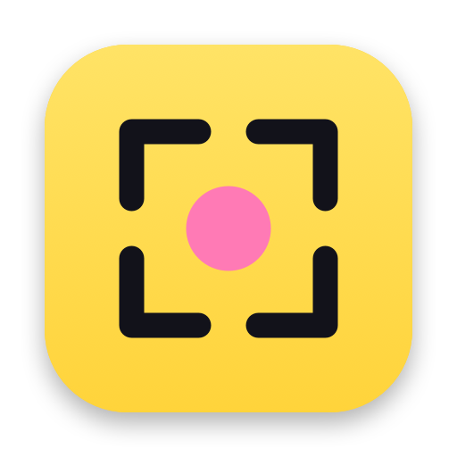

<p align="center">
  
</p>

<h1 align="center">Shot</h1>

<p align="center">
  Screenshots, annotations, and screen recordings for macOS, from the menu bar.<br>
  Free, open source, and private: no account, no cloud, no analytics.
</p>

<p align="center">
  <a href="https://github.com/LorcanChinnock/shot/releases/latest"></a>
  <a href="https://github.com/LorcanChinnock/shot/actions/workflows/ci.yml"></a>
  
  <a href="LICENSE"></a>
</p>

## Features

- **Screenshots:** area capture on a frozen screen with a magnifier, fullscreen, and window (with shadow).
- **Quick Access:** a floating card after each capture. Copy, save, annotate, show in Finder, or drag it into another app.
- **Annotation editor:** arrow, line, rectangle, ellipse, text, sticky notes, highlight, pixelate, numbered counters, and crop, with undo.
- **Screen recording:** an area, a screen, or a window to MP4. Adjust the frame, then a 3-second countdown starts the recording. Pause, resume, stop, or discard while recording.
- **Camera bubble:** a round webcam overlay that is recorded with your screen. Drag it to move it, double-click it to resize it.
- **Video trim:** drag in and out points on a recording's timeline and save without re-encoding.
- **Export options:** export a recording as MP4 or GIF, with GIF frame rate and width, mute, 1.5× or 2× speed, and the file size shown before you export. Quick Access cards export a GIF with the last settings.
- **Automation:** every action has a global shortcut and a `shot://` URL for launchers, the Shortcuts app, or scripts.

## Install

1. Download `Shot-<version>.zip` from the [latest release](https://github.com/LorcanChinnock/shot/releases/latest).
2. Unzip it and move **Shot.app** to your Applications folder.
3. Open Shot. Releases aren't notarized by Apple yet, so macOS blocks the first launch. Open **System Settings › Privacy & Security**, scroll down, and click **Open Anyway** next to the message about Shot.
4. Shot asks for **Screen & System Audio Recording** access. Turn on Shot in that list, then click **Relaunch** in Shot's window. macOS applies the permission only after a relaunch.

Shot needs macOS 15 or later and runs natively on Apple Silicon and Intel Macs. It asks for Microphone and Camera access the first time you record with them.

Shot updates itself through [Sparkle](https://sparkle-project.org) once you allow it to check for updates. Every release is signed with the same certificate, so macOS keeps Shot's Screen Recording access after an update. If you installed Shot before it could update itself, macOS asks for that access once more after your next install.

## Shortcuts

Shot takes over the macOS screenshot keys and turns off the matching macOS shortcuts, so a keyboard's screenshot key opens Shot too.

| Shortcut | Action |
|---|---|
| ⌘⇧3 | Capture fullscreen |
| ⌘⇧4 | Capture an area. Press Space to pick a window instead. |
| ⌘⇧5 | Record an area. Press Space to pick a window, or Enter for the full screen. |

While you set up a recording, the record shortcut starts it. While you record, it stops the recording. You can change any shortcut in **Settings › Shortcuts**.

To keep the macOS screenshot tool, turn off **Use Shot for ⌘⇧3 to ⌘⇧5** in **Settings › Shortcuts**. macOS gets its keys back, and Shot uses the same keys with ⌃ in place of ⌘: ⌃⇧3, ⌃⇧4, ⌃⇧5, plus ⌃⇧W for a window.

Record Fullscreen and Record Window have no shortcut until you set one. If you remove Shot, turn the macOS shortcuts back on in **System Settings › Keyboard › Keyboard Shortcuts › Screenshots**.

## URL scheme

Use `open "shot://…"` to run Shot from a launcher, the Shortcuts app, or a script:

| URL | Action |
|---|---|
| `shot://capture-area`, `capture-fullscreen`, `capture-window` | Take a screenshot |
| `shot://record`, `record-fullscreen`, `record-window` | Set up, confirm, or stop a recording |
| `shot://pause` | Pause or resume the recording |
| `shot://annotate?path=<file>` | Open an image in the editor, or a video in the video editor |
| `shot://edit-video?path=<file>` | Open a video in the video editor to trim it |
| `shot://settings?section=<name>` | Open Settings at `general`, `capture`, `quickAccess`, `recording`, `shortcuts`, or `about` |

## Privacy

Shot collects no analytics, and the only time it connects to the network is to check for updates, after you agree to it. The second time you open Shot, it asks whether to check for updates automatically. If you say yes, it fetches the update feed from GitHub once a day, and asks before installing a new version unless you tell it to install updates automatically. You can change this, or check by hand, in **Settings › About**. The GitHub links in Settings › About open in your browser.

Captures go to the folder you choose in Settings (`~/Pictures/Shot` by default) or stay in a temporary folder when saving is off.

## Build from source

You need the Xcode Command Line Tools, or Xcode.

```bash
git clone https://github.com/LorcanChinnock/shot.git
cd shot
scripts/make-dev-cert.sh   # once: a stable signing identity, so the Screen Recording permission survives rebuilds
make run                   # build, install to /Applications/Shot.app, and launch
```

See [CONTRIBUTING.md](CONTRIBUTING.md) for the other `make` targets, the project layout, and how to send a change.

## License

Shot is free software under the [GNU General Public License v3.0](LICENSE).
