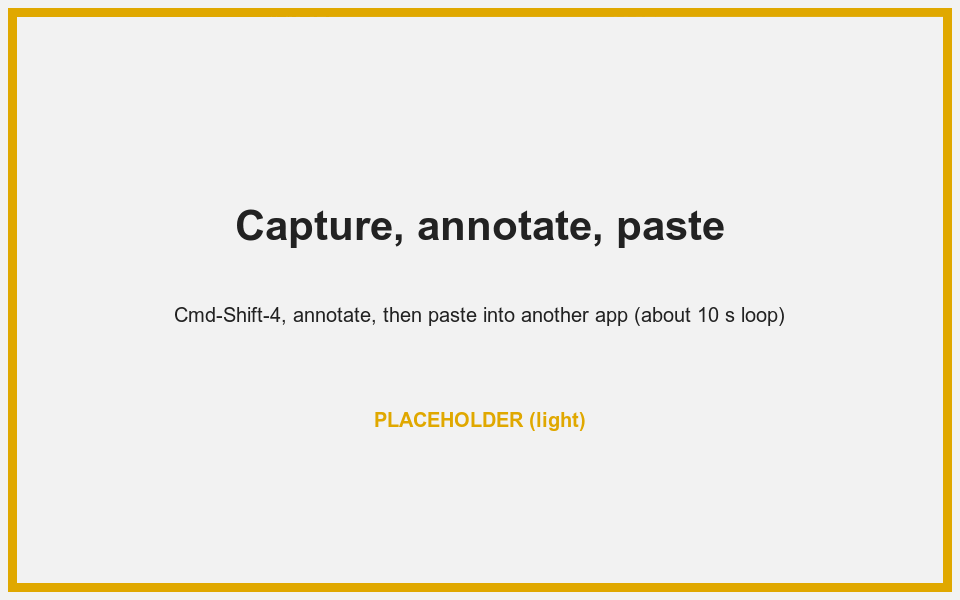
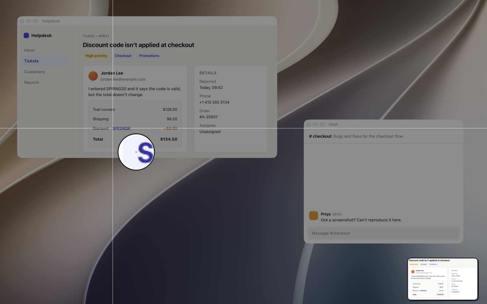
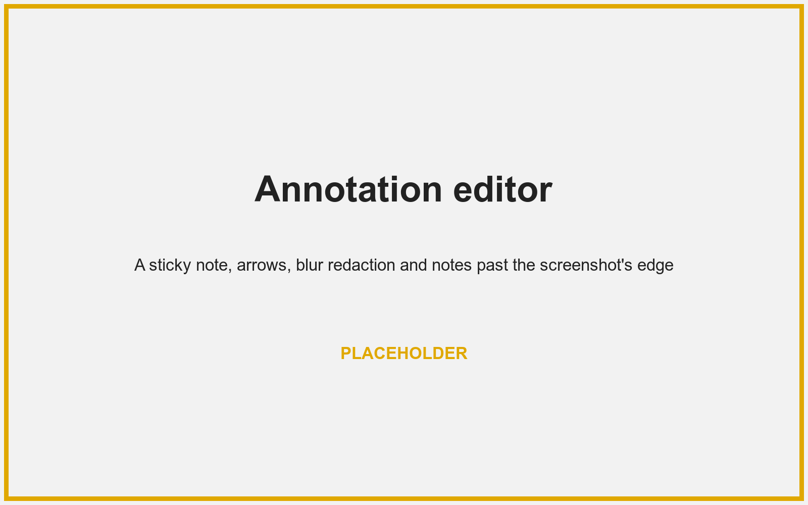
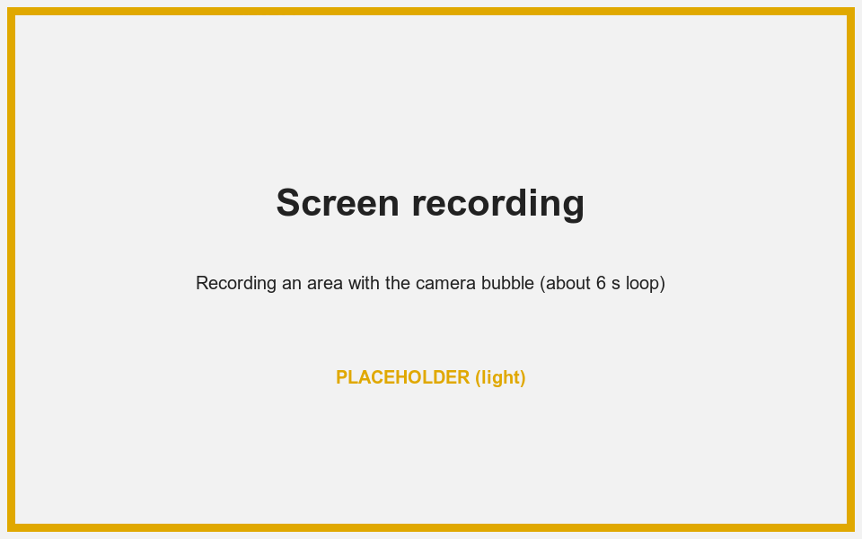
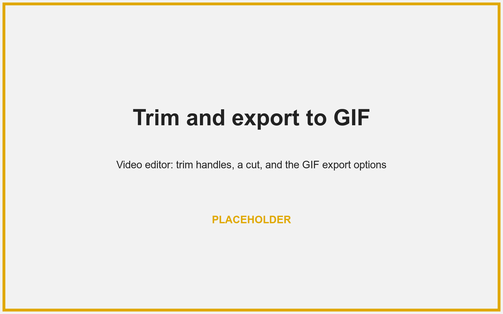
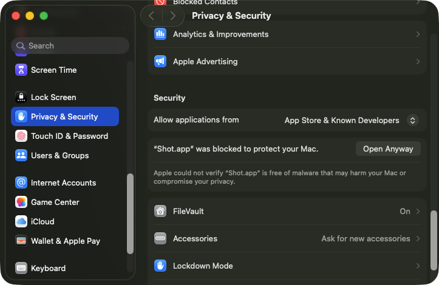

<p align="center">
  
</p>

<h1 align="center">Shot <sup>beta</sup></h1>

<p align="center">
  Screenshots, annotations, and screen recordings for macOS, from the menu bar.<br>
  Free, open source, and private: no account, no cloud, no analytics.
</p>

<p align="center">
  <a href="https://github.com/LorcanChinnock/shot/releases/latest"></a>
  
  
  <a href="LICENSE"></a>
</p>

<p align="center">
  <a href="https://github.com/LorcanChinnock/shot/releases/latest"><b>Download Shot for macOS</b></a>
</p>

<p align="center">
  <picture>
    <source media="(prefers-color-scheme: dark)" srcset="docs/media/hero-dark.gif">
    
  </picture>
</p>

### Capture and Quick Access

Pick an area on a frozen screen with a magnifier, or a window or the full screen, then copy, save, annotate or drag the capture from a floating card.

<picture>
  <source media="(prefers-color-scheme: dark)" srcset="docs/media/capture-dark.png">
  
</picture>

### Annotate anything

Arrows, sticky notes, blur and pixelate, a spotlight, a pen and more, with room to annotate outside the screenshot and to combine several images on one canvas.



### Record your screen, and yourself

Record an area, a screen or a window to MP4, with your microphone, system audio, and a round camera bubble.

<picture>
  <source media="(prefers-color-scheme: dark)" srcset="docs/media/recording-dark.gif">
  
</picture>

### Trim and export to GIF

Trim a recording, cut sections out, and export an MP4 or a GIF at the frame rate, width and speed you choose.



## Install

Shot needs macOS 15 or later and an Apple Silicon Mac. It doesn't run on Intel Macs.

**With [Homebrew](https://brew.sh):**

```sh
brew update && brew install lorcanchinnock/tap/shot
```

**Or by hand:** download `Shot-v<version>.zip` from the [latest release](https://github.com/LorcanChinnock/shot/releases/latest), unzip it, and move **Shot.app** to Applications.

### First launch

1. Open Shot from Applications. Releases aren't notarized by Apple yet, so macOS says it can't verify Shot. Click **Done**.
2. In **System Settings › Privacy & Security**, scroll down to the message about Shot, click **Open Anyway**, then confirm. You only do this once.

   

3. In Shot's permission window, click **Grant**, then **Open System Settings** in the macOS prompt, and turn on Shot. Back in Shot's window, click **Relaunch**: macOS applies the permission only after a relaunch.
4. Shot now lives in the menu bar. Press ⌘⇧4 to take your first screenshot.

Shot updates itself once you allow it to; see [Updates](docs/usage.md#updates). To uninstall, see [Removing Shot](docs/usage.md#removing-shot), or quit Shot and run `brew uninstall --zap shot` if you used Homebrew.

## Shortcuts

| Shortcut | Action |
|---|---|
| ⌘⇧3 | Capture the full screen |
| ⌘⇧4 | Capture an area. Press Space to pick a window instead. |
| ⌘⇧5 | Record an area. Press Space to pick a window, or Enter for the full screen. |

Shot takes these keys over from macOS. To keep the macOS screenshot tool, and for every other shortcut, see [Keyboard shortcuts](docs/usage.md#keyboard-shortcuts).

## More

- **[User guide](docs/usage.md):** every feature, shortcut and setting, plus the `shot://` URL scheme.
- **[Privacy](docs/usage.md#privacy):** no analytics; the network is used only to check for updates, after you agree.
- **[Contributing](CONTRIBUTING.md):** build from source, run the tests, and send a change.
- **[License](LICENSE):** free software under the GNU General Public License v3.0.
